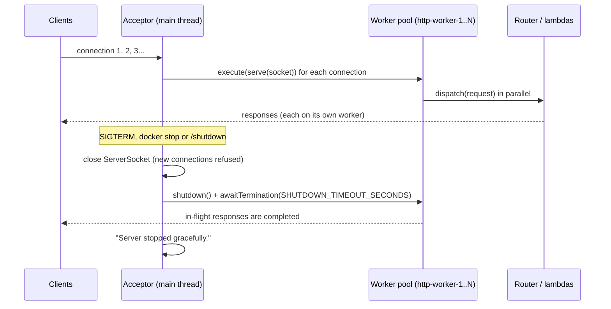
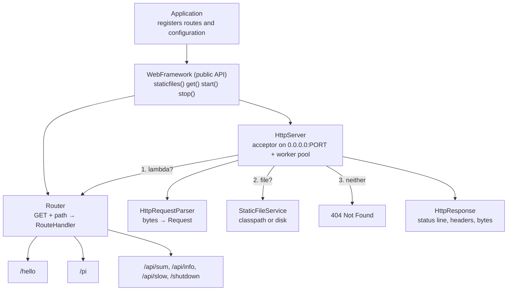
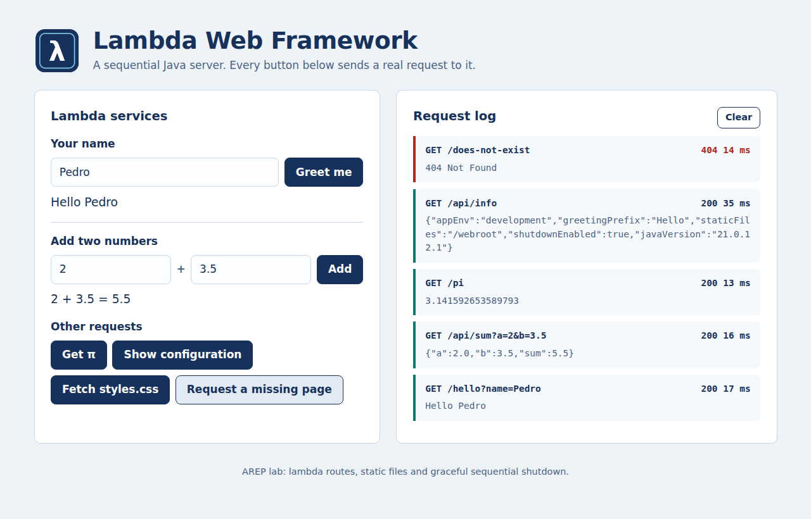
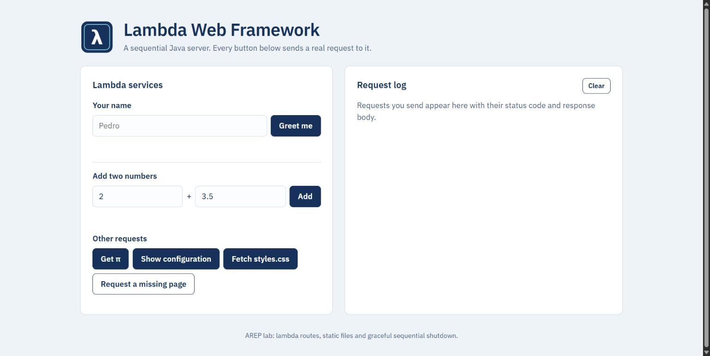
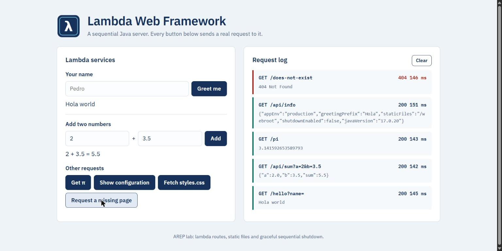

# Lambda Web Framework: a concurrent application server with graceful shutdown

A small Java web framework built on raw sockets. Developers register REST services as **lambda functions** with `get()`, declare where static files live with `staticfiles()`, and start the server with `start()`. Requests are processed **concurrently** by a pool of worker threads, and the server **shuts down gracefully**: it stops accepting connections and finishes the requests in progress, whether the stop comes from the development-only `/shutdown` route, from `docker stop` or from Ctrl+C. The same jar and Docker image run locally and on AWS EC2, configured only through environment variables.

- **Author:** Juan Esteban Cruz
- **Course:** AREP, Escuela Colombiana de Ingeniería Julio Garavito
- **Cloud platform:** AWS (Amazon EC2 + Docker, AWS Academy Learner Lab)
- **Public deployment URL:** <http://ec2-54-167-131-101.compute-1.amazonaws.com> (extension, version 2.0)
- **Docker Hub image:** [`juancruz3745/lambda-webframework:2.0`](https://hub.docker.com/r/juancruz3745/lambda-webframework)
- **Extension commit:** [`f9c4b72`](https://github.com/Cruz-Juan-r/AREP-Lambda-WebFramework-2/commit/f9c4b722544c6b95c5ca99540382d33d06949e90) "Implement concurrent request handling and graceful shutdown"

```java
import static co.edu.escuelaing.webframework.WebFramework.*;

public class Application {
    public static void main(String[] args) throws Exception {
        staticfiles("/webroot");

        get("/hello", (req, resp) -> "Hello " + req.getValueOrDefault("name", "world"));
        get("/pi", (req, resp) -> String.valueOf(Math.PI));

        start(); // reads PORT, defaults to 8080
    }
}
```

---

## Extension: concurrency, graceful shutdown and cloud deployment

### State before the extension (version 1.0)

The framework already had lambda routes, static files, externalized configuration (`PORT`, `APP_ENV`, `GREETING_PREFIX`, `STATIC_FILES_PATH`), a multi-stage `Dockerfile` and an EC2 deployment. Its server was **sequential**: one connection at a time, and `stop()` only lowered a flag, so the loop stayed blocked in `accept()` until one more client arrived.

### What the extension changes (version 2.0)

| Requirement | Before (1.0) | After (2.0) | Where |
|---|---|---|---|
| Concurrent request handling | One connection at a time; a slow request blocked every other client | One acceptor thread hands each connection to a fixed pool of named worker threads (`http-worker-N`). Size: `WORKER_THREADS`, default `max(4, 2 × CPUs)` | `HttpServer.start`, `HttpServer.serve` |
| Graceful shutdown | `stop()` set a flag; the server only noticed after the next connection | `stop()` closes the `ServerSocket` at once (new connections are refused), then waits up to `SHUTDOWN_TIMEOUT_SECONDS` (default 5) for in-flight requests; after that it interrupts them | `HttpServer.stop`, `HttpServer.drain` |
| Shutdown from the platform | Only the `/shutdown` route (development) | A JVM shutdown hook drains requests on **SIGTERM/SIGINT**: `docker stop`, Ctrl+C, EC2 shutdown | `WebFramework.start` |
| Environment-based port | `PORT` (default 8080) | Unchanged, plus `WORKER_THREADS` and `SHUTDOWN_TIMEOUT_SECONDS` validated the same way | `WebFramework.resolve*` |
| Thread safety | Not needed | `Router` lookups are synchronized; `Request`, `Response` and `HttpResponse` are created per request; `StaticFileService` is stateless | `Router` |
| Docker | Multi-stage image | Same image; the exec-form `ENTRYPOINT` makes `java` PID 1 so it receives `SIGTERM` | `Dockerfile` |
| AWS EC2 | Sequential version deployed | Version 2.0 pulled from Docker Hub and running on EC2 | [Cloud deployment](#cloud-deployment-aws-ec2--docker) |

Application code did not change: the same `get()` lambdas now run on worker threads. The example app only gained `GET /api/slow?ms=N`, which sleeps and reports the thread that served it, to make the parallelism visible.



### Evidence of the extension

Progress commit: [`f9c4b72`](https://github.com/Cruz-Juan-r/AREP-Lambda-WebFramework-2/commit/f9c4b722544c6b95c5ca99540382d33d06949e90), *Implement concurrent request handling and graceful shutdown*.

**Local Docker** ([`docs/evidence/extension-docker-concurrency-shutdown.txt`](docs/evidence/extension-docker-concurrency-shutdown.txt)): five parallel 2-second requests finish in **2.38 s** instead of ~10 s, each on a different worker. `docker stop` during a 3-second request lets it finish with `200`, and the container exits with code 143 (SIGTERM handled, not killed):

```
{"sleptMs":2000,"thread":"http-worker-2"}  ...  {"sleptMs":2000,"thread":"http-worker-6"}
Total wall time: 2.38 s  (sequential server: ~10 s)

{"sleptMs":3000,"thread":"http-worker-7"}
[client] HTTP 200 after 3.029692 s
[docker] exit code: 143

[http] [shutdown-hook] Shutdown requested: no new connections, waiting for 1 active request(s).
[http] [http-worker-7] 200 GET /api/slow?ms=3000
[http] [main] Server stopped gracefully.
```

**AWS EC2** ([`docs/evidence/extension-cloud.txt`](docs/evidence/extension-cloud.txt)), against the public URL:

```
# 5 parallel requests to /api/slow?ms=2000 over the internet
Total wall time: 2.53 s  (sequential server: ~10 s)

# docker stop lambda-web on EC2 while a 3 s request is in flight
[ec2] exit code: 143 (143 = SIGTERM handled)
[ec2 log] [http] [shutdown-hook] Shutdown requested: no new connections, waiting for 1 active request(s).
[ec2 log] [http] [http-worker-8] 200 GET /api/slow?ms=3000
[ec2 log] [http] [main] Server stopped gracefully.
[client] HTTP 200 after 3.154107 s
curl /pi after the stop: connection refused (as expected)
```

**Automated tests:** `HttpServerIntegrationTest` now proves the behavior without timing assumptions: two requests must meet at a `CyclicBarrier` inside the handler (a sequential server times out), a blocked request must not delay `/pi`, `stop()` must refuse new connections while an in-flight request still finishes with `200`, and `stop()` with no traffic must return promptly.

> Docker Desktop on the author's machine is configured with a 1-second stop timeout, which would `SIGKILL` the JVM before a 3-second request ends. The evidence therefore runs containers with `--stop-timeout 10` (Docker's usual default). The framework's own drain timeout (5 s) is kept below that value.

---

## Table of contents

1. [Features](#features)
2. [Architecture](#architecture)
3. [Architecture metaphor: a restaurant with a host and several waiters](#architecture-metaphor-a-restaurant-with-a-host-and-several-waiters)
4. [Project structure](#project-structure)
5. [Build and run locally](#build-and-run-locally)
6. [Environment variables](#environment-variables)
7. [Endpoints and example URLs](#endpoints-and-example-urls)
8. [Cloud deployment (AWS EC2 + Docker)](#cloud-deployment-aws-ec2--docker)
9. [Evidence](#evidence)
10. [Tests](#tests)
11. [Why this architecture is maintainable](#why-this-architecture-is-maintainable)

---

## Features

| Requirement | Implementation |
|---|---|
| Static HTML, CSS, JS and images | `StaticFileService` reads raw bytes from the classpath (`/webroot`) or from a disk folder, with MIME types and path-traversal protection |
| Lambda GET services | `get(path, (req, resp) -> ...)` registers a `RouteHandler` in the `Router` |
| Query-string extraction | `req.getValue("name")`, `getValueOrDefault`, `getValues` for repeated keys; URL-decoded (UTF-8, `+`, `%20`) |
| Route resolution | Lambda route → static file → `404 Not Found` |
| Error handling | `400` malformed/incomplete requests, `404` unknown resources, `405` non-GET methods, `500` if a lambda throws; the server never dies because of one request |
| Externalized configuration | `PORT`, `APP_ENV`, `GREETING_PREFIX`, `STATIC_FILES_PATH`, `WORKER_THREADS`, `SHUTDOWN_TIMEOUT_SECONDS` |
| Cloud-ready binding | Binds to `0.0.0.0`, not only `localhost` |
| Concurrent request handling | An acceptor thread plus a fixed pool of worker threads; each connection is served on its own worker |
| Graceful shutdown | `stop()`, `/shutdown` (development), `docker stop` or Ctrl+C: the `ServerSocket` closes immediately and in-flight requests finish (up to `SHUTDOWN_TIMEOUT_SECONDS`) before the process exits |

## Architecture



Request flow for every connection (the acceptor thread calls `accept()` and hands the socket to a worker, which runs the rest):

```
accept() ─► parse request line + headers ─► GET?  ── no ─► 405
                     │ malformed                 │ yes
                     ▼                           ▼
                    400                 Router has a lambda? ── yes ─► run lambda ─► 200 / custom status (500 if it throws)
                                                 │ no
                                                 ▼
                                        StaticFileService has the file? ── yes ─► 200 + bytes + MIME type
                                                 │ no
                                                 ▼
                                                404
write response ─► close connection ─► worker returns to the pool

stop(): close ServerSocket ─► acceptor leaves the loop ─► wait for workers (≤ SHUTDOWN_TIMEOUT_SECONDS) ─► exit
```

### Component responsibilities

| Component | Responsibility | Knows about sockets? |
|---|---|---|
| `Application` (`co.edu.escuelaing.app`) | Example app: reads `AppConfig`, registers static files and lambdas | No |
| `AppConfig` | Reads non-sensitive settings from environment variables with local defaults | No |
| `WebFramework` | Public facade: `staticfiles()`, `get()`, `start()`, `start(port)`, `stop()`; reads `PORT`, `WORKER_THREADS`, `SHUTDOWN_TIMEOUT_SECONDS`; registers the SIGTERM shutdown hook | No |
| `Router` / `Route` | Stores `method + path → RouteHandler`; normalizes trailing slashes; synchronized for concurrent lookups | No |
| `RouteHandler` | Functional interface implemented by the lambdas: `(Request, Response) -> String` | No |
| `Request` | Immutable method, path, query parameters and headers | No |
| `Response` | Lets a lambda set status, content type and headers | No |
| `HttpRequestParser` | Converts raw bytes into a `Request`; validates the request line, decodes the query string | Reads a stream |
| `StaticFileService` / `MimeTypes` / `StaticResource` | Finds files safely (no `..` escapes, no directories) and returns bytes + MIME type | No |
| `HttpResponse` | Serializes status line, headers and body bytes | Writes a stream |
| `HttpServer` | Acceptor loop, worker thread pool, dispatch order, error isolation, graceful stop and drain | **Yes, the only one** |

## Architecture metaphor: a restaurant with a host and several waiters

Version 1.0 was a restaurant with **exactly one waiter**: while one table ordered, everybody else waited at the door. Version 2.0 hires a **host** and a **team of waiters**.

| Restaurant | Framework component | Relationship |
|---|---|---|
| The host at the front door | Acceptor thread in `HttpServer` | Greets each arriving customer and immediately assigns a free waiter, then goes back to the door. The host never cooks or serves |
| The team of waiters (a fixed number on shift) | Worker pool (`WORKER_THREADS`) | Each waiter serves one table from order to goodbye. Several tables are served at the same time, so a customer with a slow dish no longer holds up the rest. If all waiters are busy, new customers wait briefly in line |
| The waiter's notepad, where the order is written in a standard format | `HttpRequestParser` → `Request` | Turns what the customer said (raw bytes) into a clear ticket: dish, table, special instructions (`?name=Pedro`). If the customer mumbles nonsense, the waiter politely answers "I didn't understand" (`400`) instead of fainting |
| The ticket rail that says which cook prepares which dish | `Router` | Looks up the dish name (`GET /hello`) and hands the ticket to the right station. Several waiters can read the rail at the same time |
| The cooks at their stations | Lambda handlers | Each cook knows one recipe (`/hello`, `/pi`, `/api/sum`). Hiring a new cook means adding one line to the rail, never rebuilding the dining room |
| The ready-made counter: bread, drinks, desserts already packed | `StaticFileService` | If no cook makes that item, the waiter checks the counter (HTML, CSS, JS, images). If it isn't there either: "Sorry, that's not on the menu" (`404`) |
| The plate and presentation | `HttpResponse` | Every dish leaves the kitchen on a standard plate: status line, headers, `Content-Length`, body |
| The franchise settings posted in the back office | Environment variables | Which door number to use (`PORT`), how many waiters are on shift (`WORKER_THREADS`), how long to wait for the last tables at closing (`SHUTDOWN_TIMEOUT_SECONDS`), how to greet (`GREETING_PREFIX`), training kitchen or real restaurant (`APP_ENV`) |
| Closing time | Graceful shutdown | The manager (or the landlord, `docker stop`) says "we're closing". The host locks the front door at once, so nobody new comes in, but the tables already seated finish their meal. Only if they take longer than the agreed time are they asked to leave. In the real restaurant (`APP_ENV=production`) customers can't shout "close!" (`/shutdown` does not exist), but the landlord's notice is still honored |

The key idea is still the separation between the **stable** parts (door, notepad, ticket rail, plates) and the **changing** part (the recipes). Going from one waiter to a team changed only the front of house: no recipe was rewritten.

## Project structure

```
.
├── pom.xml
├── Dockerfile / .dockerignore
├── .env.example / .gitignore
├── scripts/
│   ├── verify.sh          # smoke test (bash) against any base URL
│   └── verify.ps1         # same smoke test for Windows PowerShell
├── docs/evidence/         # local and cloud evidence referenced below
└── src/
    ├── main/java/co/edu/escuelaing/
    │   ├── webframework/  # the framework (reusable)
    │   │   ├── WebFramework.java      HttpServer.java      Router.java
    │   │   ├── Route.java             RouteHandler.java    Request.java
    │   │   ├── Response.java          HttpRequestParser.java
    │   │   ├── HttpResponse.java      StaticFileService.java
    │   │   ├── StaticResource.java    MimeTypes.java       BadRequestException.java
    │   └── app/           # the example application
    │       ├── Application.java       AppConfig.java
    ├── main/resources/webroot/
    │   ├── index.html  app.js  styles.css  images/logo.png
    └── test/java/co/edu/escuelaing/...  # 54 JUnit 5 tests
```

## Build and run locally

**Requirements:** Java 17+ and Maven 3.8+.

```bash
git clone https://github.com/Cruz-Juan-r/AREP-Lambda-WebFramework-2.git
cd AREP-Lambda-WebFramework-2
mvn clean package          # compiles and runs the 54 tests
java -jar target/lambda-webframework.jar
```

Open <http://localhost:8080>.

With custom configuration:

```bash
# Linux / macOS / Git Bash
PORT=9090 APP_ENV=development GREETING_PREFIX=Hola java -jar target/lambda-webframework.jar
```

```powershell
# Windows PowerShell
$env:PORT="9090"; $env:APP_ENV="development"; $env:GREETING_PREFIX="Hola"
java -jar target/lambda-webframework.jar
```

Stop it gracefully (development only): <http://localhost:8080/shutdown>.

Run the smoke test against the running server:

```bash
./scripts/verify.sh                       # http://localhost:8080, development
```

```powershell
.\scripts\verify.ps1
```

### Run it in Docker

Build the image from the repository, or pull the published one from Docker Hub:

```bash
docker build -t lambda-webframework .                  # or: docker pull juancruz3745/lambda-webframework:2.0
docker run --rm --name lambda-web --stop-timeout 10 -p 8080:8080 \
  -e APP_ENV=development -e WORKER_THREADS=8 -e SHUTDOWN_TIMEOUT_SECONDS=5 \
  lambda-webframework
```

See the concurrency and the graceful shutdown from another terminal:

```bash
# 5 requests of 2 s each finish together in ~2 s, on different workers
for i in 1 2 3 4 5; do curl -s "localhost:8080/api/slow?ms=2000" & done; wait

# stop the container while a request is in flight: the request still answers 200
curl -s "localhost:8080/api/slow?ms=3000" & sleep 1; docker stop lambda-web; wait
```

## Environment variables

| Variable | Purpose | Local default | Cloud value |
|---|---|---|---|
| `PORT` | TCP port the server listens on | `8080` | `8080` (container), published on port 80 |
| `APP_ENV` | Execution environment. `/shutdown` is only registered when it is `development` | `development` | `production` |
| `GREETING_PREFIX` | Prefix used by `/hello` | `Hello` | `Hola` |
| `STATIC_FILES_PATH` | Optional folder on disk for static files. If it is not an existing directory, it is read as a classpath folder | `/webroot` (classpath) | not set |
| `WORKER_THREADS` | Size of the worker thread pool (1 to 1000) | `max(4, 2 × CPUs)` | `8` |
| `SHUTDOWN_TIMEOUT_SECONDS` | How long a graceful stop waits for in-flight requests before interrupting them | `5` | `5` |

No secrets, tokens or keys are used or committed. `.env` files are ignored by Git; `.env.example` documents the variables. `GET /api/info` returns the non-sensitive configuration currently in effect, which is how the evidence below proves the variables are applied.

## Endpoints and example URLs

| Type | URL | Result |
|---|---|---|
| Static HTML | `/` or `/index.html` | Demo page |
| Static CSS | `/styles.css` | Stylesheet |
| Static JS | `/app.js` | Script that calls the services with `fetch()` |
| Static image | `/images/logo.png` | PNG served as binary |
| Lambda | `/hello?name=Pedro` | `Hello Pedro` (prefix from `GREETING_PREFIX`) |
| Lambda | `/hello` | `Hello world` (missing parameter handled) |
| Lambda | `/pi` | `3.141592653589793` |
| Lambda | `/api/sum?a=2&b=3.5` | `{"a":2.0,"b":3.5,"sum":5.5}` (two parameters) |
| Lambda | `/api/sum?a=2` | `400` with a JSON error message |
| Lambda | `/api/info` | Non-sensitive runtime configuration as JSON |
| Lambda | `/api/slow?ms=2000` | Waits 2 s (max 10 s) and returns `{"sleptMs":2000,"thread":"http-worker-3"}`; used to show concurrency |
| Lambda (dev only) | `/shutdown` | Stops the server gracefully; `404` in production |
| Error | `/unknown` | `404 Not Found` |

Cloud versions: prefix any path with `http://ec2-54-167-131-101.compute-1.amazonaws.com`, e.g. <http://ec2-54-167-131-101.compute-1.amazonaws.com/hello?name=Pedro>.

## Cloud deployment (AWS EC2 + Docker)

The deployment builds the **same source code** inside a Docker image (multi-stage `Dockerfile`: Maven builds and tests, then only the jar is copied into a JRE image). These steps work in AWS Academy Learner Lab.

### Current deployment (version 2.0)

Version 2.0 runs on EC2 instance `i-0af0789a2f2574789` (`t3.micro`, Amazon Linux 2023, `us-east-1`, AWS Academy Learner Lab). The image was built locally, published to Docker Hub and pulled on the instance:

```bash
# local machine
docker build -t lambda-webframework:2.0 .
docker tag lambda-webframework:2.0 juancruz3745/lambda-webframework:2.0
docker push juancruz3745/lambda-webframework:2.0

# on the EC2 instance (Docker installed by user data at boot)
docker pull juancruz3745/lambda-webframework:2.0
docker run -d --name lambda-web --restart unless-stopped --stop-timeout 10 \
  -p 80:8080 -e PORT=8080 -e APP_ENV=production -e GREETING_PREFIX=Hola \
  -e WORKER_THREADS=8 -e SHUTDOWN_TIMEOUT_SECONDS=5 \
  juancruz3745/lambda-webframework:2.0
```

Security group `virtualization-lab-sg`: HTTP 80 from `0.0.0.0/0`, SSH 22 only from the deployer's IP (`/32`). `--restart unless-stopped` brings the container back after an instance reboot, and every `docker stop` goes through the graceful shutdown.

### How version 1.0 was deployed

Version 1.0 (sequential) ran on instance `i-0fee51cae5c0ed33c` (`t3.micro`, Amazon Linux 2023, `us-east-1`). It was launched with the AWS CLI, with a security group allowing HTTP (80) from anywhere and SSH (22) from the deployer's IP only, and an **EC2 user-data script** that runs once at boot as root:

```bash
#!/bin/bash
dnf install -y docker git
systemctl enable --now docker

cd /home/ec2-user
git clone https://github.com/Cruz-Juan-r/AREP-Lambda-WebFramework-2.git
cd AREP-Lambda-WebFramework-2
docker build -t lambda-webframework .

docker run -d --name lambda-web --restart unless-stopped \
  -p 80:8080 \
  -e PORT=8080 \
  -e APP_ENV=production \
  -e GREETING_PREFIX=Hola \
  lambda-webframework
```

This is the same build-and-run sequence described step by step below; user-data just runs it unattended during instance boot instead of over an interactive SSH session, cloning the **public** GitHub repository directly (no credentials needed).

### Reproducing it manually

1. **Launch an EC2 instance**: Amazon Linux 2023, `t2.micro` or `t3.micro`, with a key pair.
2. **Security group inbound rules**: SSH (22) from your IP, HTTP (80) from `0.0.0.0/0`.
3. **Connect and install Docker and Git:**
   ```bash
   ssh -i "your-key.pem" ec2-user@<EC2_PUBLIC_DNS>
   sudo dnf install -y docker git
   sudo systemctl enable --now docker
   sudo usermod -aG docker ec2-user && newgrp docker
   ```
4. **Build the image from the repository:**
   ```bash
   git clone https://github.com/Cruz-Juan-r/AREP-Lambda-WebFramework-2.git
   cd AREP-Lambda-WebFramework-2
   docker build -t lambda-webframework .
   ```
5. **Run it with production configuration:**
   ```bash
   docker run -d --name lambda-web --restart unless-stopped \
     -p 80:8080 \
     -e PORT=8080 \
     -e APP_ENV=production \
     -e GREETING_PREFIX=Hola \
     lambda-webframework
   ```
6. **Check it:**
   ```bash
   docker logs lambda-web            # shows "/shutdown is disabled because APP_ENV=production"
   docker inspect lambda-web --format '{{range .Config.Env}}{{println .}}{{end}}'
   ./scripts/verify.sh http://localhost production
   ```
7. Open `http://<EC2_PUBLIC_DNS>` from your browser.

**Updating the deployment:** `git pull && docker build -t lambda-webframework . && docker rm -f lambda-web` and repeat step 5.

> Alternative platforms that inject `PORT` automatically (Render, Railway, Heroku-style) also work with the same `Dockerfile`: set `APP_ENV=production` and `GREETING_PREFIX` in the service settings and do not set `PORT` yourself.

> AWS Academy Learner Lab credentials are temporary (they expire when the lab session ends), so the instance above will stop being reachable once the lab is stopped/reset. Relaunching it takes the same `aws ec2 run-instances` call with this user-data script against a fresh Learner Lab session.

## Evidence

### Local (development)

All files in [`docs/evidence/`](docs/evidence/) were produced by running the packaged jar. The files in this subsection come from **version 1.0**, so their logs use the older format without thread names; the `extension-*` files are from version 2.0.

- Demo page served by the framework, after using every button:

  

- [`local-endpoints.txt`](docs/evidence/local-endpoints.txt): full `curl -i` output for `/hello?name=Pedro`, `/hello`, `/hello?name=Pedro&language=en`, `/pi`, `/api/sum`, `/api/info`, the static HTML/CSS/JS/PNG files, `404` for `/unknown`, `400` for a malformed request and `405` for `POST`.
- [`local-server-log.txt`](docs/evidence/local-server-log.txt): server log showing each request with its status.
- [`verify-development.txt`](docs/evidence/verify-development.txt): smoke test, 12/12 passing.

**`/shutdown` works locally in development** ([`local-shutdown.txt`](docs/evidence/local-shutdown.txt)):

```
$ curl -i http://localhost:8080/shutdown
HTTP/1.1 200 OK
Content-Type: text/plain; charset=UTF-8
Content-Length: 37

Server will stop after this response.

$ curl -i http://localhost:8080/pi   # after shutdown
curl: (7) Failed to connect to localhost port 8080: Connection refused
```

Server log for the same run:

```
[http] Shutdown requested: finishing the current request before closing.
[http] 200 GET /shutdown
[http] Server stopped gracefully.
```

**Production mode locally** ([`local-production-mode.txt`](docs/evidence/local-production-mode.txt), `PORT=9090 APP_ENV=production GREETING_PREFIX=Hola`): `/hello?name=Pedro` returns `Hola Pedro`, `/api/info` reports `"appEnv":"production","shutdownEnabled":false`, and `/shutdown` returns `404` while the server keeps running.

### Cloud (production on AWS)

Version 2.0 evidence (concurrency and graceful shutdown on EC2) is in [Evidence of the extension](#evidence-of-the-extension) and [`docs/evidence/extension-cloud.txt`](docs/evidence/extension-cloud.txt).

The screenshots below are from the **version 1.0** deployment (`http://ec2-18-234-76-168.compute-1.amazonaws.com`, `http://18.234.76.168`, instance no longer running). Its endpoints behave the same in 2.0.

- Deployed page, served by the EC2 instance:

  

- Live `fetch()` calls made from the browser against the public URL — `/api/info` (environment variables, no secrets), `/pi`, `/api/sum?a=2&b=3.5` (two query parameters), `/hello?name=` (missing parameter handled), and `/does-not-exist` (`404`) — each with its real status code and timing, taken from the deployed page's own request log:

  

- Static resource `/images/logo.png` opened directly in the browser:

  

- `/shutdown` is **not** available in production — `404 Not Found`:

  

- [`cloud-endpoints.txt`](docs/evidence/cloud-endpoints.txt): `curl -i` output for `/hello?name=Pedro`, `/hello`, `/pi`, `/api/sum?a=2&b=3.5`, `/api/sum?a=2` (`400`), `/api/info`, the static HTML/CSS/JS/PNG files, `/shutdown` (`404` in production) and `/unknown` (`404`), all run against the public URL.
- [`cloud-verify.txt`](docs/evidence/cloud-verify.txt): `./scripts/verify.sh http://18.234.76.168 production`, 13/13 passing.

Environment variables in effect on the instance, with no secrets (from `/api/info`, part of `cloud-endpoints.txt` and visible in the request-log screenshot above):

```json
{"appEnv":"production","greetingPrefix":"Hola","staticFiles":"/webroot","shutdownEnabled":false,"javaVersion":"17.0.20"}
```

## Tests

### Automated (JUnit 5, `mvn test`): 54 tests, all passing

| Test class | What it covers |
|---|---|
| `HttpRequestParserTest` (11) | Method/path/version, single and multiple query params, missing params return `null`, UTF-8 / `+` / `%26` decoding, repeated and valueless keys, bare `\n`, empty connection, malformed request lines, bad percent-encoding, bad headers, oversized lines |
| `RouterTest` (5) | Lookup, unknown path/method, trailing slash, re-registration, invalid registrations |
| `StaticFileServiceTest` (7) | HTML/CSS/JS MIME types, PNG served byte-for-byte, `/` → `index.html`, missing files and directories, path traversal blocked, disk directory mode, MIME fallback |
| `WebFrameworkTest` (5) | `PORT`, `WORKER_THREADS` and `SHUTDOWN_TIMEOUT_SECONDS`: defaults, parsing, invalid values |
| `HttpServerIntegrationTest` (16) | Real server on a random port driven through sockets: lambdas with and without params, custom status/type/headers, static HTML/CSS/JS/PNG, `404`, `400` then server still alive, empty connection, lambda exception → `500` then server still alive, `405`, graceful shutdown (response delivered, thread ends, port closed); **concurrency**: two requests meet at a `CyclicBarrier`, a blocked request does not delay others; **graceful drain**: after `stop()` new connections are refused but the in-flight request finishes with `200`; `stop()` with no traffic returns promptly |
| `AppConfigTest` (4) | Defaults, reading env values, `/shutdown` disabled outside development, blank values |
| `ApplicationHandlersTest` (6) | The example lambdas tested in isolation, without a server (including `/api/slow` validation and cap) |

### Manual requests

| Request | Expected | Result |
|---|---|---|
| `GET /hello?name=Pedro` | 200 `Hello Pedro` | ✅ |
| `GET /hello` | 200 `Hello world` | ✅ |
| `GET /pi` | 200 `3.141592653589793` | ✅ |
| `GET /api/sum?a=2&b=3.5` | 200 JSON with `sum` 5.5 | ✅ |
| `GET /index.html`, `/app.js`, `/styles.css` | 200 with correct `Content-Type` | ✅ |
| `GET /images/logo.png` | 200 `image/png`, 4292 bytes | ✅ |
| `GET /unknown` | 404 `404 Not Found` | ✅ |
| `garbage` request line | 400, server keeps running | ✅ |
| `POST /hello` | 405 with `Allow: GET` | ✅ |
| `GET /shutdown` (development) | 200, then connection refused | ✅ |
| `GET /shutdown` (production) | 404, server keeps running | ✅ |
| 5 × `GET /api/slow?ms=2000` in parallel | All finish in ~2 s, on different `http-worker-N` threads | ✅ 2.38 s local, 2.53 s on EC2 |
| `docker stop` during `GET /api/slow?ms=3000` | Request answers 200, then the container exits with 143 | ✅ local and on EC2 |

## Why this architecture is maintainable

| Principle | How it shows up here |
|---|---|
| Separation of concerns | `HttpServer` handles connections; `Router` decides who answers; lambdas implement behavior; `StaticFileService` handles files |
| Modularity | Parsing, routing, static files, response serialization and the app live in separate classes and packages (`webframework` vs `app`) |
| Low coupling | Adding `/api/sum` required one `get(...)` call. Making the server concurrent only touched `HttpServer`, `WebFramework` and a lock in `Router`: no lambda changed |
| High cohesion | Each class has one reason to change (e.g. new MIME types only touch `MimeTypes`) |
| Abstraction | Application code never sees a `Socket`; it only uses `get()`, `staticfiles()`, `start()`, `stop()` |
| Externalized configuration | Port, environment, greeting and static folder come from environment variables with safe defaults |
| Extensibility | New services are new lambdas; handlers can set status, content type and headers through `Response` |
| Testability | Parser, router, static files and each lambda are unit-tested without a network; the server is tested end-to-end on a random port |
| Operational maintainability | The same jar/image runs locally and on AWS; production disables `/shutdown` by configuration, not by code changes |
| Robustness | Per-connection error isolation (`400`/`404`/`405`/`500`), a 5-second read timeout per worker and a bounded worker pool keep one bad or slow client from stopping the server; graceful shutdown never cuts a request in progress |
